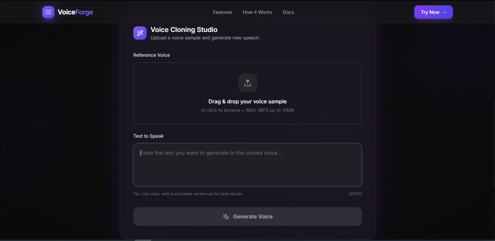

# 🎙️ VoiceForge - AI Voice Cloning Web App

A modern, full-stack voice cloning application powered by Qwen3-TTS-12Hz-0.6B-Base, FastAPI, and React. Clone any voice with just a few seconds of audio and generate natural, expressive speech.


## ✨ Features

- 🎤 **Voice Cloning** - Clone any voice from a short audio sample (3-30 seconds)
- ⚡ **Fast Generation** - Powered by Qwen3-TTS running on GPU
- 🎨 **Beautiful UI** - Modern dark theme with glassmorphism design
- 📱 **Responsive** - Works seamlessly on desktop and mobile
- 🔊 **Audio Player** - Listen to generated audio directly in browser
- 💾 **Download** - Save generated audio as WAV files
- 🌐 **Multi-language** - Supports 10+ languages including English, Chinese, Japanese, Korean, Spanish, and more

## 🛠️ Tech Stack

**Frontend:**
- React 18 with Vite
- Tailwind CSS for styling
- Framer Motion for animations
- Lucide Icons
- Axios for API calls

**Backend:**
- FastAPI (Python)
- Async request handling
- CORS enabled
- File validation

**AI/ML:**
- Qwen3-TTS-12Hz-0.6B-Base
- PyTorch with CUDA support
- Google Colab for GPU hosting
- ngrok for public tunneling

## 🚀 Quick Start

### Prerequisites
- Node.js 18+
- Python 3.9+
- Google Colab account (free)
- ngrok account (free)

### 1. Clone Repository
```bash
git clone https://github.com/Rayaanxrio/voiceforge.git
cd voiceforge
```

### 2. Frontend Setup
```bash
cd frontend
npm install
cp .env.example .env
npm run dev
```
Frontend runs at: `http://localhost:3000`

### 3. Backend Setup
```bash
cd backend
pip install -r requirements.txt
cp .env.example .env
python main.py
```
Backend API runs at: `http://localhost:8000`

### 4. Google Colab Setup
1. Upload `colab/VoiceForge_Colab_Server.ipynb` to Google Colab
2. Enable GPU runtime (Runtime → Change runtime type → GPU)
3. Run all cells in order
4. Enter your ngrok auth token when prompted
5. Copy the public URL

### 5. Connect Backend to Colab
Edit `backend/.env`:
```env
COLAB_URL=https://your-ngrok-url.ngrok-free.app
```

Restart backend:
```bash
python main.py
```

## 📸 Screenshots

### Home Page


### Voice Cloning Interface



## 🎯 How It Works

1. **Upload Reference Voice** - Provide a short audio sample (WAV, MP3, etc.)
2. **Enter Text** - Type the text you want to generate in the cloned voice
3. **Generate** - Click "Generate Voice" and wait 10-30 seconds
4. **Listen & Download** - Play the generated audio or download it

## 📁 Project Structure

```
voiceforge/
├── frontend/              # React application
│   ├── src/
│   │   ├── components/   # React components
│   │   ├── App.jsx
│   │   └── index.css
│   └── package.json
│
├── backend/              # FastAPI server
│   ├── main.py          # API endpoints
│   └── requirements.txt
│
├── colab/               # Google Colab notebook
│   └── VoiceForge_Colab_Server.ipynb
│
├── SETUP_GUIDE.md       # Detailed setup instructions
├── README.md            # This file
└── .gitignore
```

## 🔧 Configuration

### Frontend Environment Variables
```env
VITE_API_URL=http://localhost:8000
```

### Backend Environment Variables
```env
COLAB_URL=https://your-ngrok-url.ngrok-free.app
```

## 🚨 Important Notes

- **Keep Colab Running** - The server stops when Colab disconnects
- **ngrok URL Changes** - Free tier generates new URLs on restart
- **GPU Memory** - T4 GPU works fine with 0.6B model
- **File Size Limit** - Reference audio max 10MB
- **Text Length** - Max 1000 characters per generation

## 🐛 Troubleshooting

### Frontend Issues
**Port 3000 in use:**
```bash
# Edit vite.config.js and change port
```

### Backend Issues
**COLAB_URL not configured:**
```bash
# Make sure you've added the ngrok URL to backend/.env
```

**Connection timeout:**
- Check if Colab is still running
- Verify ngrok URL is correct
- Try restarting backend

### Colab Issues
**FlashAttention error on T4:**
- Already handled - notebook auto-detects GPU architecture

**Session disconnected:**
- Re-run all cells
- Update ngrok URL in backend

## 🤝 Contributing

Contributions are welcome! Please feel free to submit a Pull Request.

1. Fork the repository
2. Create your feature branch (`git checkout -b feature/AmazingFeature`)
3. Commit your changes (`git commit -m 'Add some AmazingFeature'`)
4. Push to the branch (`git push origin feature/AmazingFeature`)
5. Open a Pull Request

## 📄 License

This project is licensed under the MIT License - see the [LICENSE](LICENSE) file for details.

## 🙏 Acknowledgments

- [Qwen3-TTS](https://github.com/QwenLM/Qwen3-TTS) by Alibaba Cloud
- [FastAPI](https://fastapi.tiangolo.com/)
- [React](https://react.dev/)
- [Tailwind CSS](https://tailwindcss.com/)
- [Framer Motion](https://www.framer.com/motion/)

## 📧 Contact

Project Link: https://github.com/Rayaanxrio
---

**⭐ Star this repo if you found it helpful!**

Built with ❤️ by Rayaan using React, FastAPI, and Qwen3-TTS
